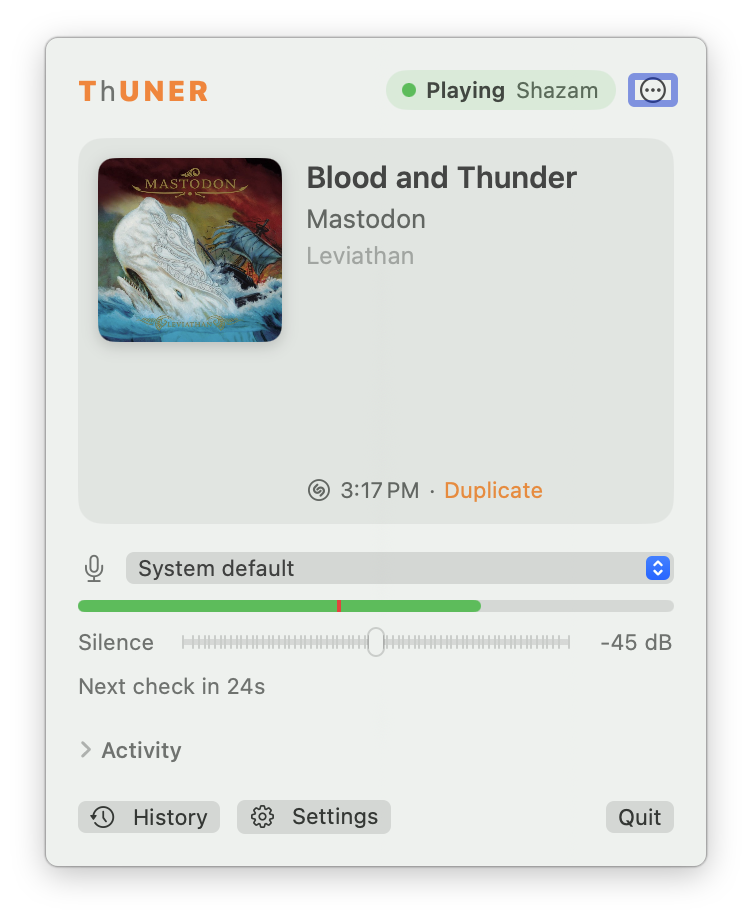

# ThUNER

A macOS menu bar app that knows what's playing (from a turntable, the room, a browser, Apple Music or Spotify), shows the cover on a [Tuneshine](https://tuneshine.rocks) or any screen, and scrobbles it to Last.fm or a self-hosted service.



**Download:** [idallas.com/software/thuner](https://idallas.com/software/thuner/). The download is notarized and keeps itself up to date.

## What it does

- **Listens carefully.** It identifies a line-in, a microphone or the Mac's own audio (a Core Audio process tap, which can be limited to certain apps) with ShazamKit. It waits for two results that agree before changing anything. It stays quiet below an adjustable silence threshold, and checks each confirmed track again near its predicted end.
- **Reads players directly.** It takes Apple Music and Spotify tracks from the apps' own notifications, with no permissions needed, and turns the mic off while they play.
- **Shows the cover:**
  - on a Tuneshine, found on the network, by uploading a 64×64 WebP to its local API
  - in a floating window or a pinnable panel
  - on a web display any browser can open
- **Two Macs, one display.** The turntable Mac has priority, coordinated over Bonjour and UDP. While the turntable plays, the other Mac pauses its mic and shows the turntable's track.
- **Scrobbles:**
  - to Last.fm, with an offline queue and duplicate detection
  - to ListenBrainz-compatible servers (ListenBrainz, Maloja, Koito, multi-scrobbler)
  - with a radio mode for not scrobbling at all
- **Can be controlled.** Twist Commando's App Link, plus a small HTTP API with Server-Sent Events. Both use one control list (`ControlSurface`).

## Requirements

- macOS 15 or later, Apple silicon or Intel.
- Xcode 16 or later to build.

## Building

```bash
swift test
```

```bash
Scripts/build-app.sh
```

This builds `build/Thuner.app`, signed ad-hoc unless you configure a signing identity.

**ShazamKit needs a signed app.** Apple only answers ShazamKit queries from an app that meets both of these conditions:

- It's signed by a **paid** Apple Developer team.
- Its App ID has the **ShazamKit** App Service turned on (Certificates, Identifiers & Profiles → Identifiers → your App ID → App Services).

An ad-hoc build runs fine, and Apple Music and Spotify, the Tuneshine, scrobbling, the web display and the API all work. But identifying audio fails with ShazamKit error 102. To build with your own team:

1. Copy `Scripts/config.example.sh` to `Scripts/config.local.sh`. Git ignores the copy.
2. Set `SIGN_IDENTITY` to your Developer ID Application certificate.
3. Set `BUNDLE_ID` to an App ID in your team that has ShazamKit turned on.

**Last.fm needs an API key.** No key is included in the source. Create one at [last.fm/api/account/create](https://www.last.fm/api/account/create) and enter it in Settings → Scrobbling. Once it's saved, `build-app.sh` builds it into your builds, so other Macs only need to approve the app on last.fm.

**Updates and stats.** Builds made from source never update themselves to official releases: development builds carry a version Sparkle won't replace. They also send no usage stats. If you publish your own builds, change `SUFeedURL` and `SUPublicEDKey` in `Resources/Info.plist` to point at your own appcast and key.

## Layout

- `Sources/ThunerCore`: pure logic, unit tested. Contains:
  - the Idle / Identifying / Playing state machine
  - the level gate
  - the two-Mac push arbiter
  - track identity
  - scrobble timing
  - play history
- `Sources/Thuner`: the app. Contains:
  - Core Audio and AVAudioEngine capture, and the System Audio process tap
  - ShazamKit matching and the player monitor
  - the Tuneshine client and the peer link
  - scrobbling services
  - the HTTP server and web display
  - the SwiftUI and AppKit interface
- `Scripts`: build, release (notarize, Sparkle appcast) and website deploy. The website itself lives in a separate repo.
- `docs`: images for this README.

[`CLAUDE.md`](CLAUDE.md) has the detailed design notes: the Tuneshine API quirks, scrobbling rules and the control API.

## The control API

When the web display is on, ThUNER serves the following on port 47480:

- `GET /`: the web display.
- `GET /now.json`: what's playing.
- `GET /api/controls`: every control and its state.
- `GET /api/events`: Server-Sent Events.
- `POST /api/controls/<id>`: changes a control. The body is `{"value": 0-1}`, `{"press": true}` or `{"on": bool}`.

Changing anything needs the token from Settings → Display, except from scripts on the same Mac. Settings → Display can also limit the server to this Mac only.

## Contributing

See [CONTRIBUTING.md](CONTRIBUTING.md). To report a security problem, see [SECURITY.md](SECURITY.md).

## License

MIT; see [LICENSE](LICENSE). Third-party licenses are in [THIRD_PARTY_NOTICES.md](THIRD_PARTY_NOTICES.md).

ThUNER isn't affiliated with or endorsed by Apple, Shazam, Spotify, Last.fm, ListenBrainz or Tuneshine. Their names are used only to describe what ThUNER works with.

The name comes from an old nickname, after the surname Bethune, and it's a tuner: the bold letters spell TUNER.
